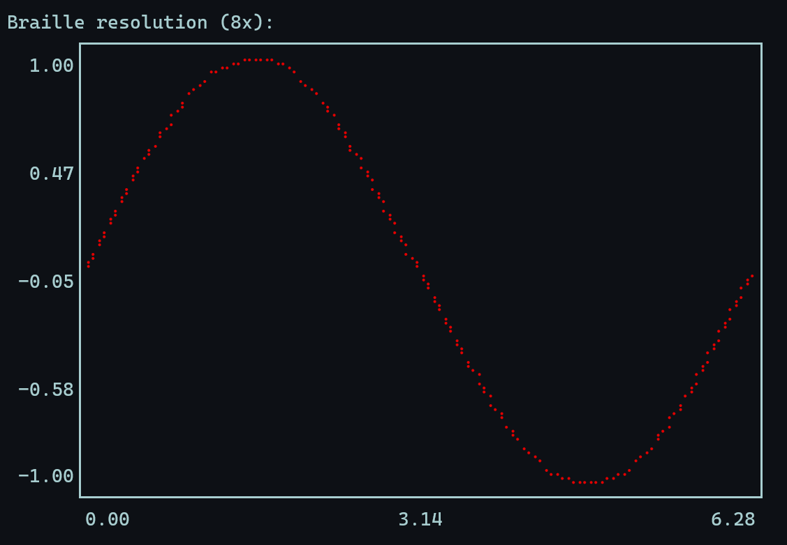
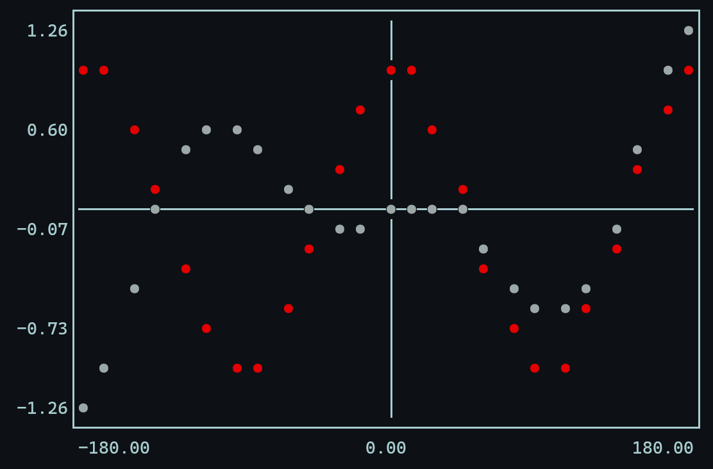
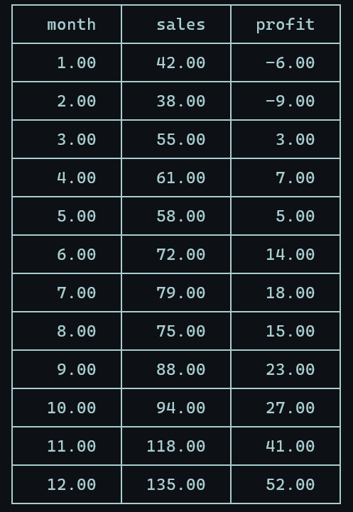
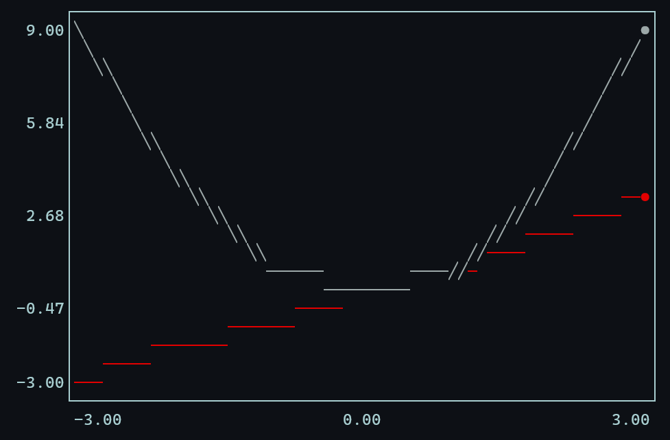
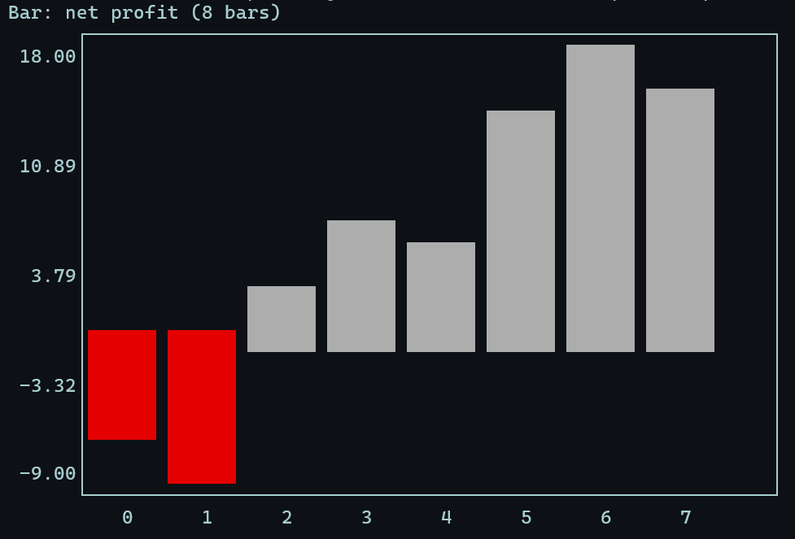
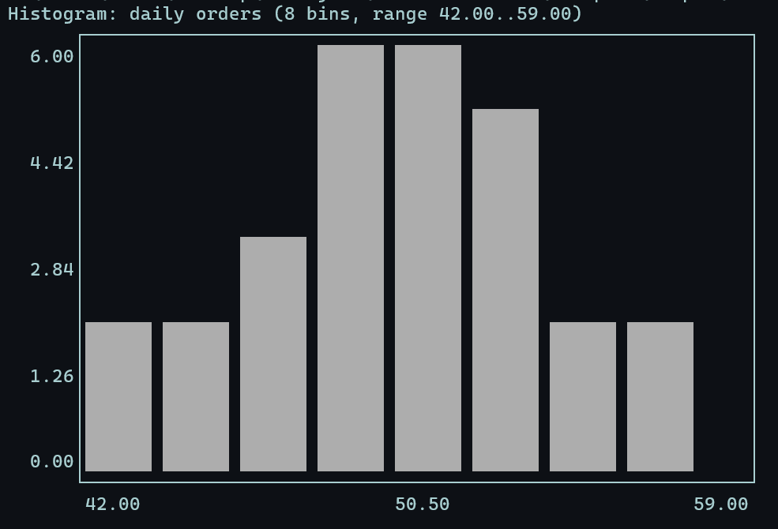
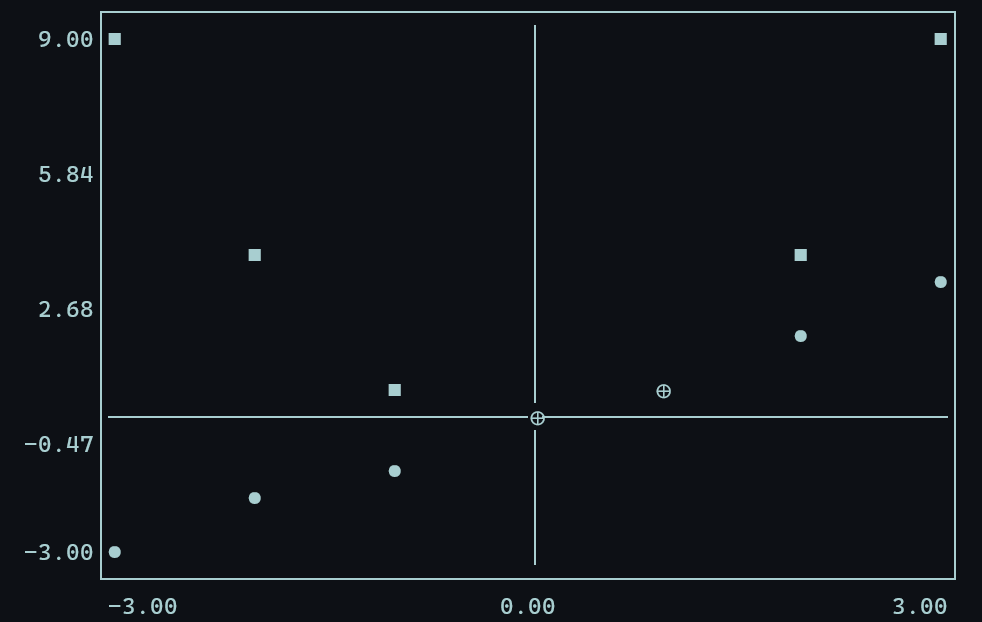
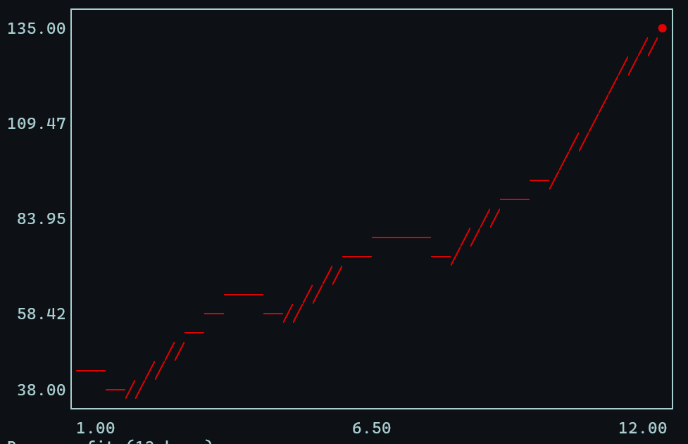
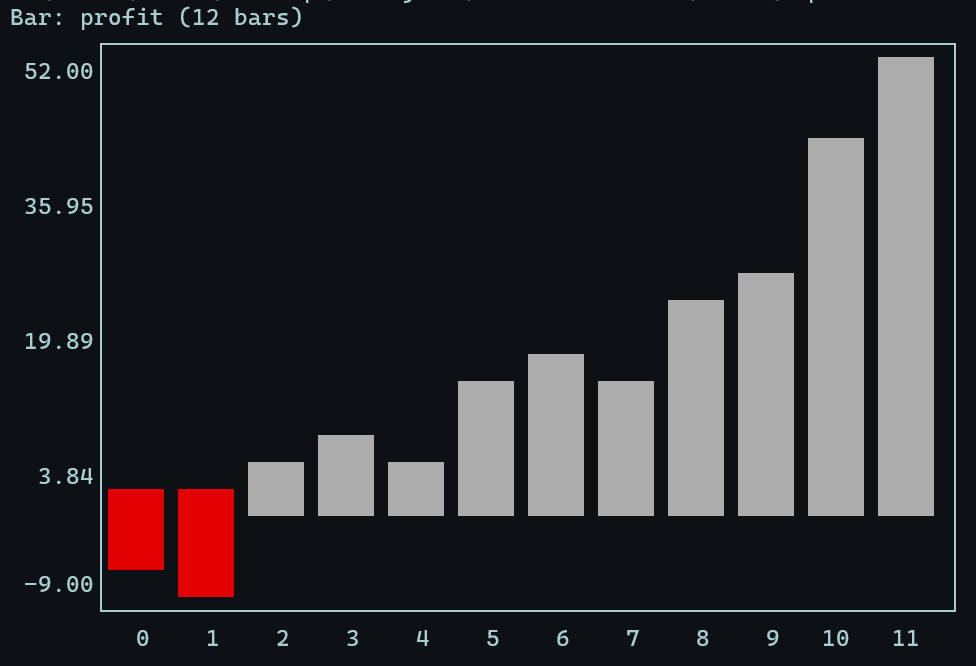

<div align="center">

# CTerminalPlot

**Tables and charts, drawn straight into your terminal — in pure, dependency-free C.**

UTF-8 box-drawing, ANSI color, and an 8× Braille mode bring matplotlib's spirit to a
single `.c` file and nothing but `libm`.

[](LICENSE)
[](https://en.wikipedia.org/wiki/C11_(C_standard_revision))
[](#install--build)
[](#install--build)
[](Makefile)
[](tests/)

<br/>

<table>
  <tr>
    <td align="center" width="50%">
      
      <br><sub><b>8× Braille line</b> — smooth curves from a 2×4 dot grid</sub>
    </td>
    <td align="center" width="50%">
      
      <br><sub><b>Multi-series scatter</b> — colored markers on auto axes</sub>
    </td>
  </tr>
</table>

</div>

---

## Contents

- [Why CTerminalPlot](#why-cterminalplot)
- [Features](#features)
- [Install & build](#install--build)
- [Quickstart](#quickstart)
- [Chart types](#chart-types)
  - [Table](#table) · [Scatter](#scatter) · [Line](#line) · [Bar](#bar) · [Histogram](#histogram)
  - [Braille hi-res (8×)](#braille-hi-res-8) · [Monochrome / `NO_COLOR`](#monochrome--no_color)
- [Load a CSV](#load-a-csv)
- [The `ctplot` CLI](#the-ctplot-cli)
- [API reference](#api-reference)
- [How it works](#how-it-works)
- [Project structure](#project-structure)
- [Roadmap](#roadmap)
- [Contributing](#contributing)
- [License & origin](#license--origin)

## Why CTerminalPlot

CTerminalPlot is a small C library (plus a `ctplot` CLI) for visualizing numeric data
**without leaving the terminal** — no GUI, no Python, no plotting backend. You build a
`DataSet` in memory (columns × rows of `float`), optionally filter / sort / analyze it, then
call a `ctp_plot*` function to draw it as a boxed table or a chart.

It's built for the moments when you just want to _see_ the numbers: debugging a C program,
eyeballing a CSV over SSH, or sketching a curve where a heavyweight plotting stack would be
overkill.

|                  |                                                             |
| ---------------- | ----------------------------------------------------------- |
| **Language**     | C11                                                         |
| **Dependencies** | the C standard library + `libm` — nothing else              |
| **Output**       | UTF-8 box-drawing + ANSI color (or pure monochrome)         |
| **Footprint**    | one `.c` (~2,000 lines), one header                         |
| **Tested**       | assertion suite + golden-output snapshots for every example |
| **License**      | MIT                                                         |

## Features

- **Five chart types** — table, scatter, line, bar, histogram — over one in-memory dataset.
- **8× Braille rendering** — a `W×H` canvas addresses a `2W×4H` dot grid for smooth curves
  (`ctp_set_graph_braille`).
- **Color _and_ monochrome modes** — series are told apart by ANSI color, or by marker
  _shape_ (`● ■ ▲ ◆`) and fill when color is off. Honors the `NO_COLOR` convention.
- **CSV in, plot out** — `ctp_read_csv()` plus a `ctplot` command-line tool
  (`ctplot data.csv --line --x 0 --y 1`, or pipe via stdin).
- **Data tools** — sort, search / filter (operators `<`, `<=`, `==`, `!=`, `>`, `>=`), and
  per-column stats (mean, population std-dev, mean absolute deviation).
- **Dependency-free & portable** — pure C11 + libm. The only OS-specific call lives behind a
  platform shim; everything else is plain UTF-8 + ANSI.
- **Leak-clean & tested** — assertion tests plus golden snapshots that catch any rendering
  regression.

## Install & build

Pure C11 + libm; needs a UTF-8 + ANSI terminal (every modern one qualifies). Developed and
tested with MinGW GCC on Windows; the source is cross-platform by design.

```sh
git clone https://github.com/Jakkarin-Promsee/CTerminalPlot-.git CTerminalPlot
cd CTerminalPlot

make            # builds build/libctp.a, every examples/*.exe, and build/ctplot.exe
make test       # builds & runs the assertion tests
make clean      # removes build artifacts

./examples/output/0_quickstart.exe   # run any example
```

### Building on Windows (MinGW)

On Windows the project builds with **MinGW GCC** (developed against MinGW GCC 6.3.0; any modern
GCC works). MinGW ships the `make` tool under the name **`mingw32-make`** — use it anywhere
these docs say `make`:

```sh
mingw32-make            # build the library, examples, and CLI
mingw32-make test       # build & run the assertion tests
mingw32-make clean      # remove build artifacts
```

The `Makefile` uses Unix-style commands (`mkdir -p`, `rm`, `ar`), so run `mingw32-make` from a
shell that provides them — **Git Bash** or the **MSYS2 / MinGW** shell, not `cmd.exe`. Make
sure MinGW's `bin\` directory (the one with `gcc.exe` and `mingw32-make.exe`) is on your
`PATH`.

**No `make` at all?** Any program compiles in a single line — this needs only `gcc` and runs
straight from PowerShell or `cmd`, with no Unix shell required:

```sh
gcc -Isrc/include examples/0_quickstart.c src/CTerminalPlotLib.c -o quickstart.exe -lm
.\quickstart.exe
```

> **Terminal tip:** for the sharpest output use a modern terminal (Windows Terminal, iTerm2,
> GNOME Terminal, …) with a monospaced font that includes box-drawing and Braille glyphs —
> e.g. Cascadia Code, JetBrains Mono, or any Nerd Font — on a dark background.

To use the library in your own program, **include the header and link the static library** —
do _not_ `#include` the `.c`:

```sh
gcc -Isrc/include your_program.c build/libctp.a -o your_program -lm
```

```c
#include "CTerminalPlotLib.h"   // built with -Isrc/include
```

## Quickstart

One call per data series — no 2-D arrays, no manual sizing. This whole program generates two
trig curves, then prints a boxed **table** _and_ a **scatter** with `ctp_plot()`:

```c
#include <stdio.h>
#include <math.h>
#include "CTerminalPlotLib.h"          // build with -Isrc/include

#define DEG2RAD(x) ((x) * M_PI / 180.0)

int main(void)
{
    const int N = 25;                  // -180° … 180°, step 15°
    DataSet *ds = ctp_initialize_dataset(/*max_cols*/ 3, /*max_name*/ 32, /*max_rows*/ N);

    CTP_PARAM angle[N], wave[N], beat[N];

    int i = 0;
    for (int deg = -180; deg <= 180; deg += 15) {
        angle[i] = deg;                                    // the X axis
        wave[i]  = cos(DEG2RAD(2 * deg - 10));             // a phase-shifted cosine
        beat[i]  = 0.4 * DEG2RAD(deg) * cos(DEG2RAD(2 * deg)); // a growing "beat"
        i++;
    }

    ctp_add_column(ds, "Angle (deg)",       angle, N);     // column 0 -> X (horizontal)
    ctp_add_column(ds, "y = cos(x)",        wave,  N);     // column 1 -> Y series
    ctp_add_column(ds, "y = 0.4x * cos(x)", beat,  N);     // column 2 -> Y series

    ctp_plot(ds);                       // boxed table + scatter
    ctp_free_dataset(ds);
    return 0;
}
```

<p align="center">
  
</p>

Column 0 is the **X axis** (drawn horizontally); every other column is a **Y series**
(drawn vertically). `ctp_plot()` prints a boxed table of the raw numbers first, then the
scatter above.

Typical flow: `initialize → add_column… → (select_axes / find / sort) → plot → free`.
**Full example: [examples/0_quickstart.c](examples/0_quickstart.c).**

---

## Chart types

Each block shows the **rendered result**, then the code that made it, then a link to the full
runnable example. Every series gets its own ANSI color in a real terminal.

### Table

A boxed, aligned table of the raw numbers — the plainest view, and the one `ctp_plot_table`
draws on its own. Below: a made-up online store's first year (`examples/data/sample.csv`).

<p align="center">
  
</p>

```c
DataSet *ds = ctp_read_csv("examples/data/sample.csv");
ctp_plot_table(ds);    // header row -> labels, numeric rows -> aligned cells
```

**Full example: [examples/11_csv.c](examples/11_csv.c).**

### Scatter

Each Y series drops its markers against the shared X column, over a zero-axis crosshair.
Distinct series in the same cell collapse to the overlap glyph (`⊕`). This is what
`ctp_plot()` draws under the table in the [Quickstart](#quickstart) above:

<p align="center">
  
</p>

```c
int y_series[] = {1, 2};
ctp_select_axes(ds, 0, y_series, 2);   // column 0 = X; columns 1 & 2 = Y series
ctp_plot_scatter(ds);
```

**Full example: [examples/0_quickstart.c](examples/0_quickstart.c).**

### Line

Connect each Y series into a continuous stroke against the shared X axis. Multiple series are
drawn at once — here a straight line (`y = x`) and a parabola (`y = x²`) over one X axis:

<p align="center">
  
</p>

```c
CTP_PARAM x[]    = {-3, -2, -1, 0, 1, 2, 3};
CTP_PARAM line[] = {-3, -2, -1, 0, 1, 2, 3}; // y = x
CTP_PARAM para[] = { 9,  4,  1, 0, 1, 4, 9}; // y = x²

ctp_add_column(ds, "x",    x,    7);
ctp_add_column(ds, "line", line, 7);
ctp_add_column(ds, "para", para, 7);

int y_series[] = {1, 2};
ctp_select_axes(ds, 0, y_series, 2);   // x is horizontal; line & para are series
ctp_plot_line(ds);
```

**Full example: [examples/7_line-plot.c](examples/7_line-plot.c).**

### Bar

One vertical bar per row on a zero baseline — positive bars rise (green; `█` in mono),
negatives drop below (red; `▒`). Here: a small shop's monthly net profit, underwater in
winter then climbing into the black.

<p align="center">
  
</p>

```c
CTP_PARAM net_profit[] = {-6, -9, 3, 7, 5, 14, 18, 15};
ctp_add_column(ds, "net profit", net_profit, 8);

ctp_plot_bar(ds);   // single column → uses column 0, zero baseline
```

**Full example: [examples/8_bar-chart.c](examples/8_bar-chart.c).**

### Histogram

Bin one column into equal-width buckets and bar the per-bin counts. Here: daily order counts
over four weeks, clustering into a rough bell once binned.

<p align="center">
  
</p>

```c
CTP_PARAM daily_orders[] = {44, 47, 49, 50, 51, 52, 53, 54, 48, 46,
                            50, 52, 53, 55, 49, 51, 52, 54, 45, 50,
                            51, 56, 48, 53, 57, 50, 42, 59};
ctp_add_column(ds, "daily orders", daily_orders, 28);

ctp_plot_histogram(ds, 8);   // 8 bins
```

**Full example: [examples/9_histogram.c](examples/9_histogram.c).**

### Braille hi-res (8×)

A Braille cell packs a 2×4 dot grid, so the same canvas resolves **8× more detail**.
`ctp_plot_line` switches between the block-glyph renderer and the Braille rasterizer on one
flag — same data, same frame, 8× the smoothness (the Braille version is the image at the top
of this README):

<p align="center">
  
</p>

```c
for (int i = 0; i < N; i++) {
    double x = (double)i / (N - 1) * 6.2831853; // 0 … 2π
    t[i]    = (CTP_PARAM)x;
    sinv[i] = (CTP_PARAM)sin(x);
}
ctp_add_column(ds, "t",   t,    N);   // column 0 -> X
ctp_add_column(ds, "sin", sinv, N);   // column 1 -> Y series
ctp_select_axes(ds, 0, (int[]){1}, 1);

ctp_plot_line(ds);                    // block resolution
ctp_set_graph_braille(ds, true);
ctp_plot_line(ds);                    // 8× Braille (above)
```

**Full example: [examples/12_braille.c](examples/12_braille.c).**

### Monochrome / `NO_COLOR`

For terminals (or pipes) without color, series are told apart by marker **shape**
(`● ■ ▲ ◆`), overlaps by `⊕`, and bar sign by **fill** (`█` up / `▒` down). It turns on
automatically when `NO_COLOR` is set, or explicitly with `ctp_set_color(ds, false)`:

<p align="center">
  
</p>

```c
ctp_select_axes(s, 0, (int[]){1, 2}, 2);  // column 0 = X; columns 1 and 2 = Y series
ctp_set_color(s, false);                  // or run with NO_COLOR=1 in the environment
ctp_plot_scatter(s);
```

**Full example: [examples/10_mono-mode.c](examples/10_mono-mode.c).**

## Load a CSV

`ctp_read_csv()` turns a CSV into a `DataSet`: the header row becomes column labels, numeric
rows become data, blank cells become empty. Below, one file —
[examples/data/sample.csv](examples/data/sample.csv), an imaginary store's first year — is
read once and plotted as a sales line (the example also draws the table and a profit bar):

<p align="center">
  
</p>

```c
DataSet *ds = ctp_read_csv("examples/data/sample.csv");

ctp_plot_table(ds);                       // 1) the raw numbers, boxed

int sales[] = {1};
ctp_select_axes(ds, 0, sales, 1);         // 2) sales (col 1) over month (col 0)
ctp_plot_line(ds);

int profit[] = {2};
ctp_select_axes(ds, 0, profit, 1);        // 3) profit (col 2) as bars
ctp_plot_bar(ds);
```

**Full example: [examples/11_csv.c](examples/11_csv.c).**

## The `ctplot` CLI

A thin command-line tool over the library — point it at a CSV (or pipe one in) and pick
charts with flags:

```sh
build/ctplot.exe examples/data/sample.csv --line --x 0 --y 1   # sales line
build/ctplot.exe examples/data/sample.csv --bar  --y 2         # profit bars
cat data.csv | build/ctplot.exe --hist --y 1 --bins 12         # or via stdin
```

<p align="center">
  
</p>

```text
Charts (combine freely; default: --table --scatter):
  --table  --scatter  --line  --bar  --hist
Options:
  --x N        horizontal / independent col   --bins N    histogram bins (default 10)
  --y N,N,...  vertical series columns         --braille   8× line rendering
  --no-color   force monochrome (also auto-off when piped, or when NO_COLOR is set)
```

`ctplot` auto-disables color when its output is piped or redirected — so a chart you pipe into
a file is clean, color-free text.

## API reference

All public symbols are prefixed `ctp_`. Functions that return `malloc`'d arrays note who frees
them; everything else hangs off the one `DataSet`.

| Area      | Functions                                                                                               |
| --------- | ------------------------------------------------------------------------------------------------------- |
| Lifecycle | `ctp_initialize_dataset`, `ctp_free_dataset`                                                             |
| Load data | `ctp_add_column`, `ctp_add_row`, `ctp_add_data`, `ctp_add_label`, `ctp_read_csv`                        |
| Axes      | `ctp_select_axes`, `ctp_reset_axes`                                                                      |
| Plot      | `ctp_plot`, `ctp_plot_table`, `ctp_plot_scatter`, `ctp_plot_line`, `ctp_plot_bar`, `ctp_plot_histogram` |
| Style     | `ctp_set_color`, `ctp_set_graph_braille`, `ctp_set_graph_resolution`, `ctp_set_table_width`, …           |
| Transform | `ctp_sort`, `ctp_findOne`, `ctp_findMany`, `ctp_reset_find`                                              |
| Analyze   | `ctp_analyze_mean`, `ctp_analyze_sd`, `ctp_analyze_md` (+ `_search` variants)                           |
| Inspect   | `ctp_printf_dataset`, `ctp_printf_properties`, `ctp_printf_memory_usage`                                 |

Per-topic guides live in [docs/](docs/) (start at [docs/0_all_docs.md](docs/0_all_docs.md));
the full public surface is declared in
[src/include/CTerminalPlotLib.h](src/include/CTerminalPlotLib.h).

## How it works

Everything hangs off one heap-allocated `DataSet` — **column-major** `float` cells
(`db[column][row]`) with capacities fixed at `ctp_initialize_dataset`. The vector renderers
(line, bar, histogram, Braille) rasterize into a small internal **`CtpCanvas`** — a glyph +
color grid with a Bresenham line-draw — then flush through one boxed-frame printer
(`ctp_canvas_flush`) plus an X-axis labeller. Braille is the same idea at 8×: a boolean dot
grid whose 2×4 cells map to the code points `0x2800 + mask`.

The only OS-specific code (`SetConsoleOutputCP(CP_UTF8)` on Windows) lives behind
`ctp_platform_init()`, guarded by `#ifdef _WIN32`; elsewhere it falls back to `setlocale`.
Every public renderer calls it, so a direct `ctp_plot_scatter` still emits correct UTF-8.

See [CLAUDE.md](CLAUDE.md) for the full source map and conventions.

## Project structure

```text
CTerminalPlot/
 ├── src/
 │   ├── CTerminalPlotLib.c      # the whole library implementation (~2,000 lines)
 │   ├── include/
 │   │   └── CTerminalPlotLib.h  # the public API: types, prototypes, config
 │   └── ctplot.c                # the ctplot CLI front-end
 ├── examples/                   # runnable, documented programs (0 → 12)
 │   ├── 0_quickstart.c          #   one call per series → table + scatter
 │   ├── …                       #   one example per feature
 │   └── data/sample.csv         #   sample input for the CSV demo
 ├── tests/
 │   ├── test_ctp.c              # assertion tests (make test)
 │   └── golden/*.txt            # captured output; diff to catch regressions
 ├── docs/                       # per-topic guides
 ├── assets/                     # README screenshots
 ├── Makefile                    # build the library, examples, CLI, and tests
 ├── ROADMAP.md                  # the refactor history & what's next
 └── CLAUDE.md                   # source map & conventions for contributors
```

## Roadmap

The library is correct (assertion-tested, leak-clean), structured as a real linkable library,
portable, and feature-complete for the chart types above. Remaining polish — a plot legend,
nicer axis ticks, a regression best-fit line, and CI — is tracked in [ROADMAP.md](ROADMAP.md).

## Contributing

Issues and pull requests are welcome. A good change:

1. keeps every example building and rendering — run `make && make test` and diff the examples
   against `tests/golden/`;
2. if it legitimately alters rendering, regenerates the affected golden file and says so in
   the commit;
3. follows the commit-prefix convention (`feat:` / `fix:` / `refactor:` / `docs:` / `chore:`).

See [CLAUDE.md](CLAUDE.md) for the source map, conventions, and the toolchain notes.

## License & origin

Released under the [MIT License](LICENSE).

> _This began as a first-year university C final project — hand-rolled "OOP in C", a dynamic
> array, and a terminal plotter, written before AI assistants were any good. It has since been
> refactored into a portfolio piece: correctness and memory-safety fixed, split into a real
> linkable library, made portable, and given the chart types, CLI, and docs above. The full
> level-by-level history is in [ROADMAP.md](ROADMAP.md)._
