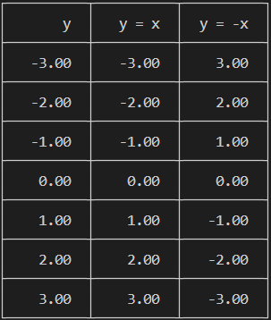
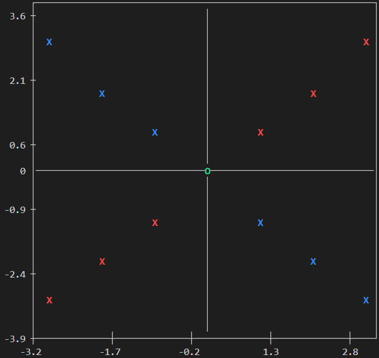

<!-- 2_Basic-Usage.md -->

# **CTerminalPlotLib - Basic Usage**

## **Contents**

- [Overview](#overview)
- [Initialize the Data Set](#initialize-the-data-set)
- [Add Data to Columns](#add-data-to-columns)
- [Add Column Labels](#add-column-labels)
- [Display Memory Usage](#display-memory-usage)
- [Create Plots](#create-plots)
- [Free Memory](#free-memory)
- [Complete Example](#complete-example)

## **Overview**

CTerminalPlotLib operates on a sequence of steps:

1. **Initialize** a data set with specified dimensions
2. **Add data** for columns
3. **Add labels** for columns
4. Optionally **display memory usage**
5. **Plot** the data (tables and scatter plots)
6. **Free** allocated memory

## **Initialize the Data Set**

```c
DataSet *ctp_initialize_dataset(int max_param, int max_name_size, int max_param_size);
```

**Parameters:**

- `max_param`: Maximum number of columns
- `max_name_size`: Maximum length for column names
- `max_param_size`: Maximum number of rows per column

**Example:**

```c
int max_cols_size = 3;
int max_name_length = 20;
int max_rows_size = 10;

DataSet *dataSet = ctp_initialize_dataset(max_cols_size, max_name_length, max_rows_size);
```

## **Add Data to Columns**

```c
void ctp_add_data(DataSet *dataset, CTP_PARAM *data, int max_row, int avaliable_col, int avaliable_row);
```

**Parameters:**

- `dataSet`: Pointer to initialized data set
- `data`: Pointer to data array
- `max_row`: Maximum rows in data array (for address calculation)
- `avaliable_col`: Number of columns to add
- `avaliable_row`: Number of rows to add

**Example:**

```c
int available_cols = 3;
int available_rows = 7;
int max_rows = 10;

// data[][max_rows] - Cannot use variable for array size
CTP_PARAM data[][10] = {
    {-3, -2, -1, 0, 1, 2, 3}, // Column 0 (y values)
    {-3, -2, -1, 0, 1, 2, 3}, // Column 1 (x values for series 1)
    {3, 2, 1, 0, -1, -2, -3}  // Column 2 (x values for series 2)
};

ctp_add_data(dataSet, *data, max_rows, available_cols, available_rows);
```

## **Add Column Labels**

```c
void ctp_add_label(DataSet *dataset, char *name, int max_name_length, int avaliable_name);
```

**Parameters:**

- `dataSet`: Pointer to initialized data set
- `name`: Pointer to array of strings containing column labels
- `max_name_length`: Maximum length of each label
- `avaliable_name`: Number of labels to add

**Example:**

```c
int available_name = 3;
int max_name_length = 20;

// name[][max_name_length] - Cannot use variable for array size
char name[][20] = {
    "y",      // Column 0 (y-axis)
    "y = x",  // Column 1 (first series)
    "y = -x", // Column 2 (second series)
};

ctp_add_label(dataSet, *name, max_name_length, available_name);
```

## **Display Memory Usage**

```c
void ctp_printf_memory_usage(const DataSet *dataSet);
```

**Parameters:**

- `dataSet`: Pointer to initialized data set

**Example:**

```c
ctp_printf_memory_usage(dataSet);
```

## **Create Plots**

```c
void ctp_plot(DataSet *dataSet); // Plot Both Table And Scatter
void ctp_plot_table(DataSet *dataSet); // Plot Only Table
void ctp_plot_scatter(DataSet *dataSet); // Plot Only Scatter
```

**Parameters:**

- `dataSet`: Pointer to initialized data set

**Example:**

```c
ctp_plot(DataSet *dataSet); // Plot Both Table And Scatter
ctp_plot_table(DataSet *dataSet); // Plot Only Table
ctp_plot_scatter(DataSet *dataSet); // Plot Only Scatter
```

## **Free Memory**

```c
void ctp_free_dataset(DataSet *dataset);
```

**Parameters:**

- `dataSet`: Pointer to initialized data set

**Example:**

```c
ctp_free_dataset(dataSet);
```

## **Complete Example**

```c
#include <stdio.h>
#include "../src/CTerminalPlotLib.c"

int main() {
    // 1. Initialize data set
    int max_cols_size = 3, max_name_length = 20, max_rows_size = 10;
    DataSet *dataSet = ctp_initialize_dataset(max_cols_size, max_name_length, max_rows_size);

    // 2. Prepare data
    int available_cols = 3, available_rows = 7, max_rows = 10;
    CTP_PARAM data[][10] = {
        {-3, -2, -1, 0, 1, 2, 3}, // Column 0 (y-axis)
        {-3, -2, -1, 0, 1, 2, 3}, // Column 1 (x values for series 1)
        {3, 2, 1, 0, -1, -2, -3}  // Column 2 (x values for series 2)
    };

    // 3. Add data to data set
    ctp_add_data(dataSet, *data, max_rows, available_cols, available_rows);

    // 4. Prepare labels
    int available_name = 3;
    char name[][20] = {
        "y",      // Column 0 (y-axis)
        "y = x",  // Column 1 (first series)
        "y = -x", // Column 2 (second series)
    };

    // 5. Add labels to data set
    ctp_add_label(dataSet, *name, max_name_length, available_name);

    // 6. Display memory usage (optional)
    ctp_printf_memory_usage(dataSet);

    // 7. Create plots
    ctp_plot(dataSet);

    // 8. Free allocated memory
    ctp_free_dataset(dataSet);

    return 0;
}
```

**Output:**

Table output:  


Scatter plot:  

