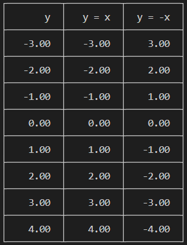
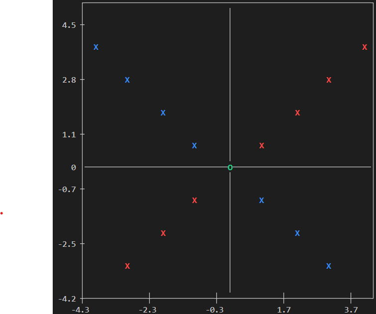

<!-- 3_add-row.md -->

# ** Overview **

- ### 0. Used Sample Data Set from part before ([2_basic_usage.md](2_basic-usage.md))

- ### 1. Add more Row Data

  ```c
  void ctp_add_row(DataSet *dataSet, CTP_PARAM data[]);
  ```

---

<br>

# Add more Row Data

- ### Docs:

  ```c
  void ctp_add_row(DataSet *dataSet, CTP_PARAM data[]);
  ```

- ### Parameters:

  - `dataSet`: The data set pointer from `ctp_initialize_dataset` used to store all address of Data Set
  - `data`: The data pointer to add into the data set. The size of data array must match with dataSet column

- ### Usage:

  ```c
  // The size of data array must match with dataSet column, which is 3 in this case
  CTP_PARAM new_row[3] = {4, 4, -4};
  ctp_add_row(dataSet, new_row);
  ```

---

<br>

# All Sample

- ## **.C code** ([go to .c file](../examples/3_add-row.c))

  ```c
  #include <stdio.h>
  #include "../src/CTerminalPlotLib.c"

  int main()
  {
  // Example basic usage from 1_basic-usages
  // Initialize data set
  int max_cols_size = 5, max_name_length = 20, max_rows_size = 10;
  DataSet \*dataSet = ctp_initialize_dataset(max_cols_size, max_name_length, max_rows_size);

      // Add data to data set
      int available_cols = 3, available_rows = 7, max_rows = 10;
      CTP_PARAM data[][10] = {
          {-3, -2, -1, 0, 1, 2, 3}, // Column 0 (default y-axis)
          {-3, -2, -1, 0, 1, 2, 3}, // Column 1 (default x-axis)
          {3, 2, 1, 0, -1, -2, -3}  // Column 2 (default x-axis)
      };
      ctp_add_data(dataSet, *data, max_rows, available_cols, available_rows);

      // Add label to data set
      int available_name = 3;
      char name[][20] = {
          "y",      // Column 0 (default y-axis)
          "y = x",  // Column 1 (default x-axis)
          "y = -x", // Column 2 (default x-axis)
      };
      ctp_add_label(dataSet, *name, max_name_length, available_name);

      //--------------------------------------------------------------------
      // Add more Row Data

      // The size of data array must match with dataSet column, which is 3 in this case
      CTP_PARAM new_row[3] = {4, 4, -4};
      ctp_add_row(dataSet, new_row);

      // Default Plot (both table and scatter)
      ctp_plot(dataSet);

      // Free Allocate memeory of Data Set
      ctp_free_dataset(dataSet);

      return 0;

  }
  ```

- ## Terminal Output

  

  <br>

  

```

```
