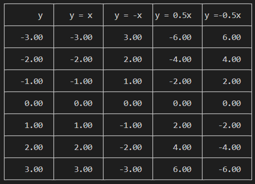
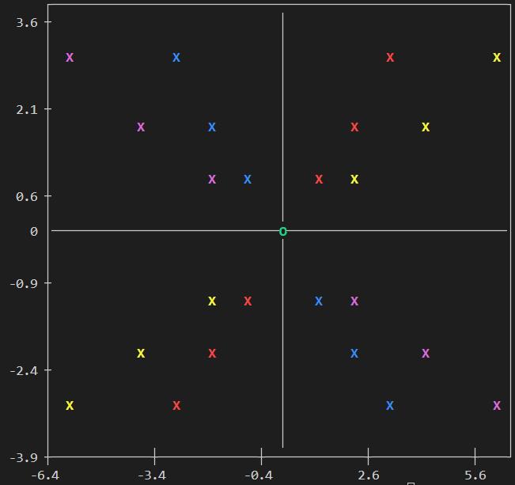

<!-- 4_Adding-Column.md -->

# **CTerminalPlotLib - Adding Columns**

## **Contents**

- [Overview](#overview)
- [Adding Additional Columns](#adding-additional-columns)
- [Adding Column Labels](#adding-column-labels)
- [Complete Example](#complete-example)

## **Overview**

This guide demonstrates how to add new columns to an existing dataset in CTerminalPlotLib. This allows you to expand your dataset with additional data series without recreating it from scratch.

## **Adding Additional Columns**

You can add new columns using the same `ctp_add_data` function you're already familiar with:

```c
void ctp_add_data(DataSet *dataSet, CTP_PARAM *data, int max_rows, int available_cols, int available_rows);
```

**Parameters:**

- `dataSet`: Pointer to your initialized data set
- `data`: Pointer to your new data array
- `max_rows`: Maximum rows in your new data array (for address calculation)
- `available_cols`: Number of new columns to add
- `available_rows`: Number of rows in your new columns

**Important Notes:**

- Your dataset must be initialized with sufficient capacity for the additional columns
- The new columns should have the same number of rows as existing data
- For best results, add all columns before calling `ctp_plot()`

**Example:**

```c
// Add two new data columns
int new_available_cols = 2, new_available_rows = 7, new_max_rows = 10;
CTP_PARAM new_data[][10] = {
    {-6, -4, -2, 0, 2, 4, 6}, // New column 3
    {6, 4, 2, 0, -2, -4, -6}  // New column 4
};
ctp_add_data(dataSet, *new_data, new_max_rows, new_available_cols, new_available_rows);
```

## **Adding Column Labels**

After adding new columns, you'll typically want to add corresponding labels:

```c
void ctp_add_label(DataSet *dataSet, char *name, int max_name_length, int available_name);
```

**Parameters:**

- `dataSet`: Pointer to your initialized data set
- `name`: Pointer to array of strings containing new column labels
- `max_name_length`: Maximum length of each label
- `available_name`: Number of new labels to add

**Example:**

```c
// Add labels for the new columns
int new_available_name = 2;
char new_name[][20] = {
    "y = 0.5x", // Label for new column 3
    "y = -0.5x" // Label for new column 4
};
ctp_add_label(dataSet, *new_name, max_name_length, new_available_name);
```

## **Complete Example**

The following example demonstrates how to add new columns to an existing dataset:

```c
#include <stdio.h>
#include "../src/CTerminalPlotLib.c"

int main() {
    // 1. Initialize data set with room for growth
    int max_cols_size = 5, max_name_length = 20, max_rows_size = 10;
    DataSet *dataSet = ctp_initialize_dataset(max_cols_size, max_name_length, max_rows_size);

    // 2. Add initial data
    int available_cols = 3, available_rows = 7, max_rows = 10;
    CTP_PARAM data[][10] = {
        {-3, -2, -1, 0, 1, 2, 3}, // Column 0 (y-axis)
        {-3, -2, -1, 0, 1, 2, 3}, // Column 1 (x-axis, series 1)
        {3, 2, 1, 0, -1, -2, -3}  // Column 2 (x-axis, series 2)
    };
    ctp_add_data(dataSet, *data, max_rows, available_cols, available_rows);

    // 3. Add initial column labels
    int available_name = 3;
    char name[][20] = {
        "y",      // Column 0 (y-axis)
        "y = x",  // Column 1 (x-axis, series 1)
        "y = -x", // Column 2 (x-axis, series 2)
    };
    ctp_add_label(dataSet, *name, max_name_length, available_name);

    // 4. Add new data columns
    int new_available_cols = 2, new_available_rows = 7, new_max_rows = 10;
    CTP_PARAM new_data[][10] = {
        {-6, -4, -2, 0, 2, 4, 6}, // New column 3
        {6, 4, 2, 0, -2, -4, -6}  // New column 4
    };
    ctp_add_data(dataSet, *new_data, new_max_rows, new_available_cols, new_available_rows);

    // 5. Add labels for the new columns
    int new_available_name = 2;
    char new_name[][20] = {
        "y = 2x",   // Label for new column 3
        "y = -2x"   // Label for new column 4
    };
    ctp_add_label(dataSet, *new_name, max_name_length, new_available_name);

    // 6. Create plots with the expanded dataset
    ctp_plot(dataSet);

    // 7. Free allocated memory
    ctp_free_dataset(dataSet);

    return 0;
}
```

**Output:**

Table with added columns:  


Scatter plot with added series:  


## **Use Cases**

Adding columns is particularly useful when:

- You want to compare multiple data series
- You're adding new variables to your analysis
- You're building a comprehensive dataset incrementally

## **Next Steps**

After mastering the basic functionality, you may want to explore customizing your plots using the advanced features of CTerminalPlotLib.
